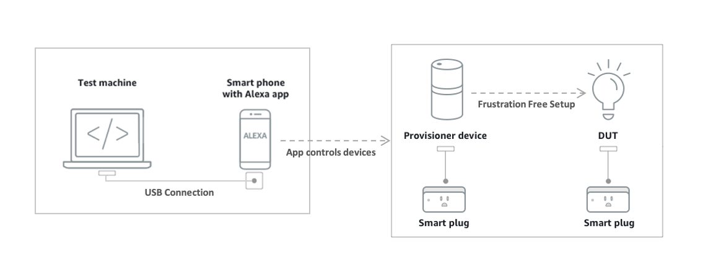

# Amazon Frustration Free Setup Certification Tool

Python-based automation test scripts which can help Non-Amazon device partners to launch their devices with FFS with shorten self-certification time. The document will describe how to run those scripts to complete the certification tests, especially the provisioning performance test.

## Frustration Free Setup Overview
See [Understanding Frustration-Free Setup](https://developer.amazon.com/docs/frustration-free-setup/understanding-ffs.html) for more information.

## Frustration Free Setup Certification Process
See [Provisionee Certification Guide](https://developer.amazon.com/docs/frustration-free-setup/provisionee-certification.html) for more information.

## Requirements and Getting started

* 1 Android phone in USB debugging mode
    * Alexa App installed and login with your Amazon account
    * The phone is connected with your test machine (Windows, MacOS or Linux) with USB connection.
* 1 Provisioner device, which is registered to your Amazon account, see recommended devices from [Understanding Frustration-Free Setup - Testing Your Device](https://developer.amazon.com/docs/frustration-free-setup/understanding-ffs.html#testing-your-device)
* 1 Provisionee device, your device under test, called DUT in this document
* 2 Control devices, [Amazon Smart Plugs](https://www.amazon.com/dp/B089DR29T6) are recommended
    * Please register both to your Amazon account.
    * Please plug DUT on top of one smart plug, and turn that plug **ON** if DUT has been registered to your Amazon account, or **OFF** if DUT is in factory reset mode.
    * Please plug the provisioner device on top of the other smart plug, and turn it **ON**.
* Please submit your DUT to pre-register our device setup service via [Submit Test Devices](https://developer.amazon.com/frustration-free-setup/console/manage/submit-test-devices)



## Test Machine Environment setup

* Please download and install **Python3 (>=3.7), JDK, Android SDK, and Appium (1.20.2)** 
* Please configure $PATH, $JAVA_HOME and $ANDROID_HOME to run **adb** and **appium** commands
* Please run the commands below to verify the environment setup
```
$ python --version
Python 3.7.9
```
```
$ adb --version
Android Debug Bridge version 1.0.41
Version 30.0.5-6877874
Installed as ***/Android/sdk/platform-tools/adb
```
```
$ appium --version
1.20.2
```

## Run Test Scripts
Open a terminal on Mac/Linux or PowerShell (Admin) on Windows
### Step 1: Setup Python virtual environment
```
$ python -m venv <your_venv_name>
```
### Step 2: Activate virtual environment

[MacOS/Linux]
```
$ source venv/bin/activate
```

[Windows]
```
> .\venv\Scripts\Activate.ps1
```

### Step 3: Install python dependencies in the virtual environment

```
(<your_venv_name>) pip install Appium-Python-Client pytest-repeat
(<your_venv_name>) pip install -e .
```

### Step 4: Execute the test
```
(<your_venv_name>) pytest [Options]
```

**Options:**

**--ffs_type**
* FFS protocol type, one of ["BSS", "ZSS"], "BSS" as default

**--name_of_plug_to_control_dut**
* Name of the smart plug (displayed on Alexa App) to power on and off DUT, **"First plug"** as default</br>

**--name_of_plug_to_control_provisioner**
* Name of the smart plug (displayed on Alexa App) to power on and off provisioner, **"Second plug"** as default</br>

**--name_of_dut**
* Name of the device under test displayed on Alexa App after the setup, required option

**--appium_server_port**
* Port used to start appium server on localhost, **4723** as default

**--count**
* Num of iterations

**-x**
* Use it to stop the execution if any iteration failed

**Examples:**

Run 10 iterations against BSS device named "First switch" and stop the execution if any iteration failed
```
(<your_venv_name>) pytest --ffs_type=BSS --name_of_dut="First switch" --count=10 -x
```
Run 5 iterations against ZSS device named "First light" and continue the execution if some iterations failed
```
(<your_venv_name>) pytest --ffs_type=ZSS --name_of_dut="First light" --count=5
```
## Test Report and Logging
* **pytest.ini** file includes pytest configuration:
    * log-cli settings enable the live log and test summary from console output 
    * log-file settings save the logging to **pytest_log.txt** in logs folder
* **appium_server_log.txt** from logs folder includes all appium_server logs during the test

## Notes
* So far the tool only supports multiple rounds of BSS or ZSS test as removing both types of devices from Alexa App will factory reset them
* It could support WSS over Wifi if removing a WSS over Wifi device from the third party app can factory reset it and you need to override methods in wss_device.py (template/psudocodes provided)

## Security

See [CONTRIBUTING](CONTRIBUTING.md#security-issue-notifications) for more information.

## License

This project is licensed under the Apache-2.0 License.

